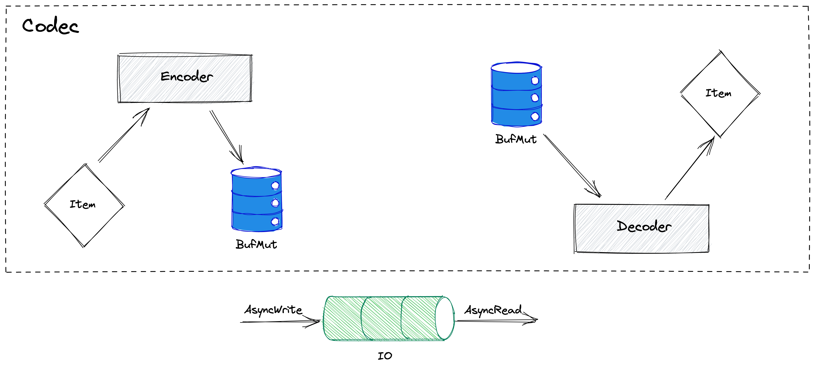
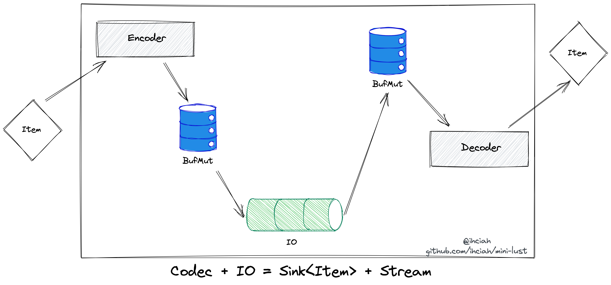

# 连接抽象

本章主要写 Codec 和 Transport。

## 0x00 Codec 和 Transport

### 0x00.0 Codec

Codec 通常指对消息的编解码方式。在 [tokio-util](https://docs.rs/tokio-util/0.6.7/tokio_util/codec/index.html) 中，有 Codec 的通用定义：

```rust
pub trait Decoder {
    type Item;
    type Error: From<io::Error>;
    fn decode(&mut self, src: &mut BytesMut) -> Result<Option<Self::Item>, Self::Error>;
}

pub trait Encoder<Item> {
    type Error: From<io::Error>;
    fn encode(&mut self, item: Item, dst: &mut BytesMut) -> Result<(), Self::Error>;
}
```



Codec 提供了什么抽象？Codec 是 **Item** 和 **二进制** 之间的转换方式。

如果我们明确了 Protocol（如确定使用 Binary Protocol），那么我们的 Message 就是一种 Item 到 二进制 的转换实现。 所以我们可以为 Message 带上 Protocol 实现 Codec。

这里有个问题：我们上一章已经可以对消息做序列化和反序列化了，为什么还要搞一个 Codec 抽象呢？ 解释一下：一是因为我们还有一些 Protocol 无关的包装，二是因为实现 Codec 接口后，可以利用 tokio-util
里面的一些便捷的工具。

包装比如 Thrift Framed，会在发送的消息前面加上 4 字节的消息长度，这个包装其实和 Protocol 是什么类型没啥关系。

我们上一章提到了 Framed 协议头，这个也是 Item 和二进制互转的时候的东西，也可以抽象为 Codec。

### 0x00.1 多层 Codec 如何串联

假设我们现在要实现消息的序列化，最后在外面套一个 4 字节的 Framed 头。 显然这里有两层 Codec：一个是对消息的序列化，另一个是再外面加长度头。

一个可行的方式是这样的：

1. 先将具体的消息（如 GetUserRequest）作为 Item，将其经过 Codec1 序列化并写入 BufMut。
2. 从 BufMut 切下已写入数据块并 freeze 为 Buf。
3. 将 Buf 作为 Item 经过 Codec2 添加 4 字节头并写入 BufMut。

这样做的好处是分层清晰，如果我们的框架内有多层 Codec，可以将职责分清楚。

但是这么做的坏处也十分明显：

1. 无法复用 BufMut，因为写入之后就切下扔掉了。
2. 有大量拷贝，每个 Codec 都会拷贝一份数据。


那么有没有更好的方案呢？（话都说到这了那肯定是有的）我们可以将 Codec 以洋葱的模型套起来！

1. 外层只感知一个 Codec，只调用最外层。Codec1 负责在 BufMut 中分配 4 字节大小。
2. Codec1 调用 Codec2 的 encode，Codec2 序列化消息。
3. Codec2 调用返回后，Codec1 计算其内层写入的总长度并写入之前分配的 4 字节头内。


好了，我们省掉了多余的拷贝，也可以将 BufMut 复用起来了。

### 0x00.2 Transport

Codec + 连接 可以构造出 Transport，即 `Sink<Item> + Stream`，可以直接用于读写对象(Sink 是一个可以不断 send 进去的池子，Stream 是可以用 next 来不断取数据的流)。

tokio-util 提供了 Framed 类型（注意这个和 Thrift Framed 是两回事），可以便捷地将 Codec 和 Read+Write 封装为 Transport， 这个 Transport 实现了 Sink +
Stream，可以让我们省掉手动序列化的麻烦。



## 0x01 实现 Codec

实现 Codec 的问题在于，如何定义 Item 以传递充足的信息？

首先我们要允许 Error 作为消息体的一部分传递，因为 Thrift 允许用户传递 Exception，这个 Exception 可能以 Error 的形式和用户代码交互。

Error 可以在 Server 侧序列化时编码进消息发出去，序列化过程出错可以抛出自己的 Error；反序列化可以返回 Error，可以用于打印日志等。

其次是我们要允许编解码时能够共享（包括修改）一些信息，如 read_message_begin 时发现 Type 是 Exception，那么这个将影响后续对消息正文的解码。 或者自定义类似 Framed 的 Codec 用于携带元信息。

所以我们将 Item 定义为 (MsgContext, Result<T, ApplicationError>) 使其可以将 Error 作为 Item 返回，并将 MsgContext 作为信息透传载体。 用户自定义 Exception
算作 T 的一部分。

### 0x01.0 实现 Framed Codec

Framed Codec 是正常的消息前面加 4 字节的长度。

注：我们实现了 `Encoder<T>` 是因为我们不关心 T 是什么，所以不需要写 `Result<T, Error>`。

```rust
pub struct FramedCodec<C>(C);

impl<C> FramedCodec<C> {
    #[allow(dead_code)]
    pub fn new(c: C) -> Self {
        FramedCodec(c)
    }
}

// The max message size is limited to 16M.
const MAX_MESSAGE_SIZE: usize = 16 * 1024 * 1024;

impl<C, T> Encoder<T> for FramedCodec<C>
    where
        C: Encoder<T>,
        crate::Error: From<C::Error>,
{
    type Error = crate::Error;

    fn encode(&mut self, item: T, dst: &mut BytesMut) -> Result<(), Self::Error> {
        let zero_index = dst.len();
        // Alloc 4-byte space
        dst.reserve(4);
        unsafe {
            dst.advance_mut(4);
        }
        // Call inner encoder
        self.0.encode(item, dst).map_err(Into::into)?;
        let written = dst.len() - 4 - zero_index;
        if written > MAX_MESSAGE_SIZE {
            return Err(new_protocol_error(
                ProtocolErrorKind::SizeLimit,
                format!("Frame of length {} is too large.", written),
            ));
        }
        let mut buf = &mut dst[zero_index..zero_index + 4];
        buf.put_u32(written as u32);
        Ok(())
    }
}

impl<C> Decoder for FramedCodec<C>
    where
        C: Decoder,
        crate::Error: From<C::Error>,
{
    type Item = C::Item;
    type Error = crate::Error;

    fn decode(&mut self, src: &mut BytesMut) -> Result<Option<Self::Item>, Self::Error> {
        if src.len() < 4 {
            // Not enough data to read length marker.
            return Ok(None);
        }

        // Read length marker.
        let mut length_bytes = [0u8; 4];
        length_bytes.copy_from_slice(&src[..4]);
        let length = u32::from_be_bytes(length_bytes) as usize;

        // Check that the length is not too large to avoid a denial of
        // service attack where the server runs out of memory.
        if length > MAX_MESSAGE_SIZE {
            return Err(new_protocol_error(
                ProtocolErrorKind::SizeLimit,
                format!("Frame of length {} is too large.", length),
            ));
        }

        if src.len() < 4 + length {
            // The full string has not yet arrived.
            //
            // We reserve more space in the buffer. This is not strictly
            // necessary, but is a good idea performance-wise.
            src.reserve(4 + length - src.len());

            // We inform the Framed that we need more bytes to form the next
            // frame.
            return Ok(None);
        }

        // Skip the 4-byte length.
        src.advance(4);
        let decoded = self.0.decode(src)?;
        match decoded {
            None => Err(new_protocol_error(
                ProtocolErrorKind::InvalidData,
                "unable to decode message which the data size is enough for decoding",
            )),
            Some(inner) => Ok(Some(inner)),
        }
    }
}
```

上述实现非常简单：

1. 编码时预留 4 字节，之后调用内部编码器。最后计算一下已编码长度，再去写预留字段。
2. 解码时读取长度，如果已有数据不够这个长度，则返回 `Ok(None)` 表示数据不够。 如果数据足够，则可以直接解码。

### 0x01.1 为 Message 实现 Codec

前面提到，Message + Protocol = Codec。由于目前我们只实现了一种 BinaryProtocol，我们可以直接为 Message 实现 Codec。 
后续如果实现了 Compact Protocol，可以在 Codec 初始化的时候指定。

```rust
#[derive(Debug)]
pub struct MessageCodec<E, D> {
    strict: bool,
    _phantom: PhantomData<fn(E, D)>,
}

impl<E, D> MessageCodec<E, D> {
    #[allow(unused)]
    pub fn new(strict: bool) -> Self {
        Self {
            strict,
            _phantom: PhantomData,
        }
    }
}

impl<E, D> Encoder<(MsgContext, Result<E, ApplicationError>)> for MessageCodec<E, D>
    where
        E: Message,
{
    type Error = crate::Error;

    fn encode(
        &mut self,
        item: (MsgContext, Result<E, ApplicationError>),
        dst: &mut BytesMut,
    ) -> Result<(), Self::Error> {
        // We hard code BinaryProtocol for now. TODO: fix it
        let mut protocol = TBinaryOutputProtocol::new(dst, self.strict);
        let (mut cx, item) = item;
        match item {
            Ok(it) => {
                protocol.write_message_begin(&cx.identifier)?;
                it.encode(&cx, &mut protocol)?;
            }
            Err(err) => {
                cx.identifier.message_type = TMessageType::Exception;
                protocol.write_message_begin(&cx.identifier)?;
                err.encode(&cx, &mut protocol)?;
            }
        }
        protocol.write_message_end()?;
        Ok(())
    }
}

impl<E, D> Decoder for MessageCodec<E, D>
    where
        D: Message,
{
    type Item = (MsgContext, Result<D, ApplicationError>);
    type Error = crate::Error;

    fn decode(&mut self, src: &mut BytesMut) -> Result<Option<Self::Item>, Self::Error> {
        // We hard code BinaryProtocol for now. TODO: fix it
        let mut protocol = TBinaryInputProtocol::new(src, self.strict);
        let mut cx = MsgContext::default();

        cx.identifier = protocol.read_message_begin()?;
        if cx.identifier.message_type == TMessageType::Exception {
            // TODO: decode to Exception
            let exception = ApplicationError::decode(&mut cx, &mut protocol)?;
            protocol.read_message_end()?;
            return Ok(Some((cx, Err(exception))));
        }
        let item = D::decode(&mut cx, &mut protocol)?;
        protocol.read_message_end()?;
        Ok(Some((cx, Ok(item))))
    }
}
```

之前定义的 MsgContext 现在派上用场了：读写到 TMessageIdentifier 会操作 MsgContent 中的 identifier 字段。

### 0x01.2 关于 read_message_begin/write_message_begin 的说明

前面提到的 Message 类似 Protobuf，只是对结构体的序列化。 我们都知道，gRPC 涉及的信息不只是 Protobuf，还有 RPC 元信息，比如调用的方法名等。

gRPC 中调用元信息通过 HTTP Header 传递，而 Thrift 并不是基于 HTTP2 来实现的，那么 RPC 元信息对应过来是什么呢？答案是 `write_message_begin`/`read_message_begin`
。

当我们处理 RPC 消息时，我们往往需要通过在最开始 `write_message_begin`/`read_message_begin` 来读写 `TMessageIdentifier`（`TMessageIdentifier`
后面紧跟的就是普通的序列化后的结构体数据了）， `TMessageIdentifier` 这个结构体主要包含了 RPC method 的名字、message type（Call/Reply/Exception/Oneway）和 sequence
id（唯一标记这个这个请求，可用于匹配请求和响应）。它序列化 / 反序列化时读写的信息从哪里来？答案是 MsgContext。

当请求收发时需要做 `write_message_begin`/`read_message_begin`，这一步我们选择做在刚刚拿到消息的时候，即 Codec 与 Message 的转换层，所以你在 MessageCodec 的实现里可以看到相关调用。

## 0x02 生成匿名结构
为了便于接口定义和调用信息传递，生成一些匿名结构体会比较有帮助。

1. 我们可以为所有的请求和响应分别生成一个结构体（以将多个字段合成单个结构体）并为这个结构体实现 Message。
   
   因为收发请求时多个字段其实的确是要编码为结构体发送的， 例如请求有多个参数，那么我们把这多个参数搞成一个 struct。
   
   接收响应时虽然只有一个返回结果，但是这个结果可能是用户 IDL 中的 Response 结构体，也可能是用户定义的 Exception，所以生成为 Enum。
2. 之后为所有的请求和响应生成两个总的 enum 结构体，在解码时根据 MsgContext 中的 Method 信息路由并解析：因为是固定结构体所以有助于更简单地实现 Codec。
   
   例如 ItemService 有 GetARequest 和 GetBRequest，我们将这些 Request 合并为单个 Enum 类型。

注：之所以合并的 Request 和 Response 以及这个 Enum 叫匿名结构，是因为这些结构在 IDL 定义里是不存在的。

